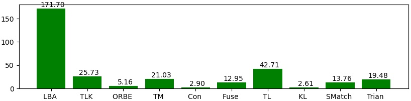
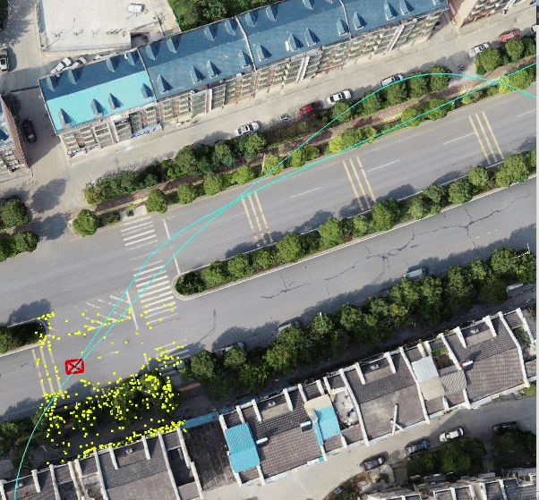

# Multi Camera Visual SLAM 
This repo is aim to realise a simple visual slam system which support multi camera configruation. Meanwhile, we also utilize the OpensceneGraph to simulate some drone motion scene with groundtrugh trajectory, also use it to visulize our sparse mapping result, and try to find some strategies to improve the system.

Currently, I am mainly use it to build a convinent platform for accomplish my thesis. So I have no more energy to manage pull request and merge request, Any idea or question or suggestion is welcome to be descuss in issues.

# Feature
- Multi camera hierarchical optimization based on multi resolution cameras observation.
- A multi thread Framework similar to ORB_SLAM but more simple and readable.
- Unified Matching process code  as well as  Optimizing  to reduce redundancy


# Dependency 
- [fmt](https://github.com/fmtlib/fmt) **For Log and formating console output**
- [cmdline](https://github.com/tanakh/cmdline)
- [yaml](https://github.com/jimmiebergmann/mini-yaml) **Base on it , and support parsing array type.**
- [ROS melodic](http://wiki.ros.org/melodic/Installation/Ubuntu) 
- [opencv](https://github.com/opencv/opencv) 4+  with  [contrib](https://github.com/opencv/opencv_contrib)
- [Open Scene Graph](https://github.com/openscenegraph/OpenSceneGraph)


# TODO 
- [X] [Capture](./modules/capture/README.md)
- [ ] Image Rectification && pre-process (`currently, test data are simulated from osg, no need to do`)  
- [X] local feature extractor (ORB | SURF | Super Point) \ matcher
- [X] [OSG](https://github.com/openscenegraph/OpenSceneGraph) Viewer 、Visulization Tracjtory and Camera and Maps.
- [X] Visual Odemetry
- [X] Local Mapping with Essential Graph
- [ ] LoopClosing with Dbow 
- [X] Visualization of Essentialgraph
- [X] [osg_viewer interaction specification](modules/osg_viewer/README.md)
- [ ] Quantification of Reprojection Error with Scene Model,  Calculated by 
- [ ] Build instruction (`If someone is intrested on this prototype`)
- [ ] Quantification of ATE or RTE.

    $$ e = ||z_{messured} - z_{buffer_from osg} ||_2^2$$

# Multi Camera Configuration


```
                ┌─────────  stereo────────┐
                │                         │
                │                         │
                │                         │
                │                         │
                ▼           110           ▼
                30     ┌──────────┐      30
             ┌──────┐  │          │   ┌──────┐
             │      │  │          │   │      │
 body center │ left │  │    wide  │   │ right│
             └──x───┘  │          │   └───x──┘
                x      └─────x────┘       x
                x            x            x
                x            x            x
                x            x            x
                x            x            x
                x            x            x
                ───────────────────────────────────►
                0            0.5m         1.0m
```


# Time Performance

2000 ORB feature points in each image, running on i7-9700 with single thread.



# Evaluation Results
```
RPE w.r.t. translation part (m)
for delta = 1 (frames) using consecutive pairs
(with SE(3) Umeyama alignment)

       max      0.266661
      mean      0.064595
    median      0.053899
       min      0.004208
      rmse      0.078455
       sse      6.179843
       std      0.044528

APE w.r.t. translation part (m)
(with SE(3) Umeyama alignment)

       max      0.823292
      mean      0.408878
    median      0.383366
       min      0.080387
      rmse      0.430832
       sse      186.544597
       std      0.135776
```
# Demo 



