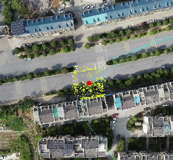
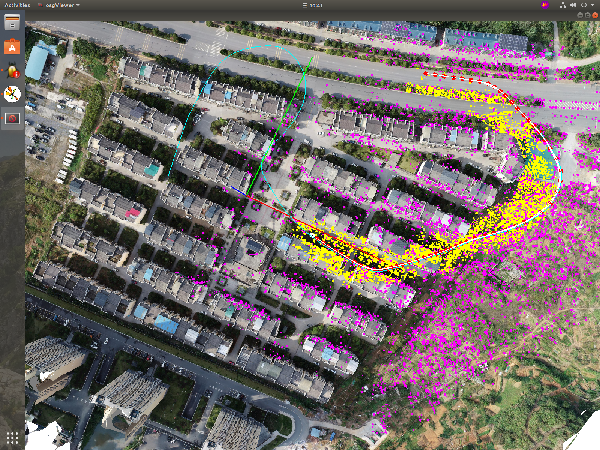
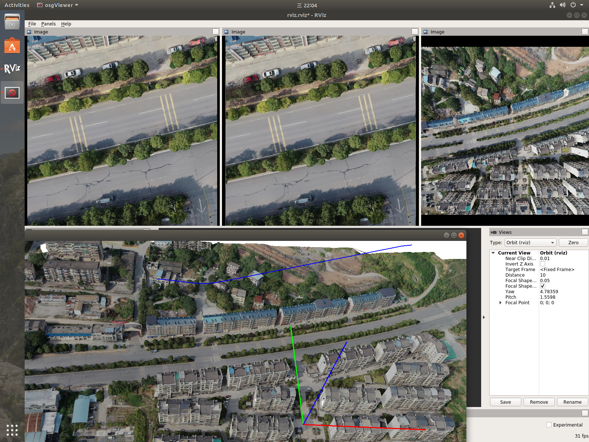

# multi camera repo 


# Feature
- Multi camera hierarchical optimization based on multi resolution cameras observation.
- A multi thread Framework similar to ORB_SLAM but more simple and readable.
- Unified Matching process code  as well as  Optimizing  to reduce redundancy


# Dependency 
- [fmt](https://github.com/fmtlib/fmt) **For Log and formating console output**
- [cmdline](https://github.com/tanakh/cmdline)
- [yaml](https://github.com/jimmiebergmann/mini-yaml) **Base on it , and support parsing array type.**
- [ROS melodic](http://wiki.ros.org/melodic/Installation/Ubuntu) 
- [opencv](https://github.com/opencv/opencv) 4+  with  [contrib](https://github.com/opencv/opencv_contrib)
- [Open Scene Graph](https://github.com/openscenegraph/OpenSceneGraph)


# TODO 
- [X] [Capture](./modules/capture/README.md)
- [ ] 图像读取、矫正、预处理， 
- [X] local feature extractor (ORB | SURF | Super Point) \ matcher
- [X] [OSG](https://github.com/openscenegraph/OpenSceneGraph) Viewer 、Visulization Tracjtory and Camera and Maps.
- [X] Visual Odemetry
- [X] Local Mapping with Essential Graph
- [ ] LoopClosing with Dbow 
- [ ] Visualization of Essengraph
- [ ] Quantifiation of Reprojection Error with Scene Model,  Calculated by 

    $$ e = ||z_{messured} - z_{buffer_from osg} ||_2^2$$

# Multi Camera Configuration


```
                ┌─────────  stereo────────┐
                │                         │
                │                         │
                │                         │
                │                         │
                ▼           110           ▼
                30     ┌──────────┐      30
             ┌──────┐  │          │   ┌──────┐
             │      │  │          │   │      │
 body center │ left │  │    wide  │   │ right│
             └──x───┘  │          │   └───x──┘
                x      └─────x────┘       x
                x            x            x
                x            x            x
                x            x            x
                x            x            x
                x            x            x
                ───────────────────────────────────►
                0            0.5m         1.0m
```


# Time Performance

2000 ORB feature points in each image

| Item               | ms        | fps        | Notes                   |
| ------------------ | --------- | ---------- | ----------------------- |
| ORB_EXTRACT        | 5.661095  | 176.641137 | 3 thread                |
| Stereo Matching    | 26.477234 | 37.768153  |                         |
| Track Local Map    | 17.467155 | 57.249981  | (Project & grid search) |
| Track LastKeyFrame | 15.152356 | 65.995901  | (Bow match)             |
|                    |           |            |                         |
|                    |           |            |                         |
|                    |           |            |                         |







