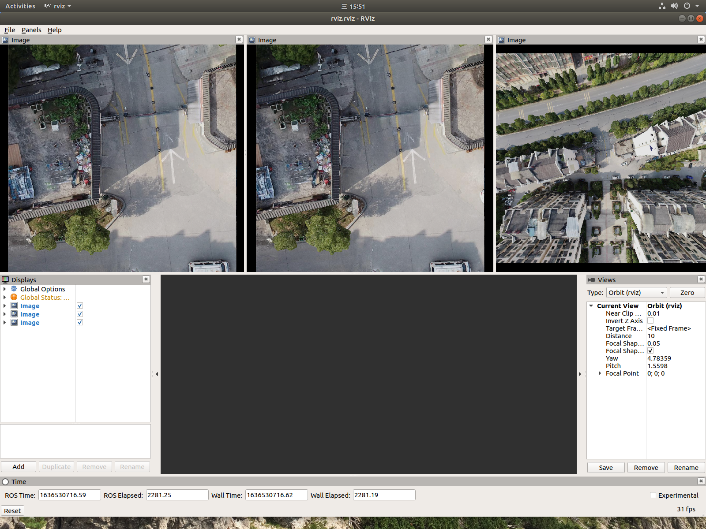

# Capture 
The Capture module can grab multiple folder or video file simutlanously, The only you to do is provide a specific config file. 

The follow `config/capture.yaml` configuration file create 3 capture and post image with respective ros topic.

```yaml
Capture_cnt: 3
Capture.fps: 20

Capture0.VideoPath: "/home/wen/SLAM/Datasets/data/left/1610443311331890616.png"
Capture0.topic: "left/image"

Capture1.VideoPath: "/home/wen/SLAM/Datasets/data/right/1610443311331890616.png"
Capture1.topic: "right/image"

Capture2.VideoPath: "/home/wen/SLAM/Datasets/data/wide/1610443311331890616.png"
Capture2.topic: "wide/image"
```

By using rviz, you can visulize the three image stream.

